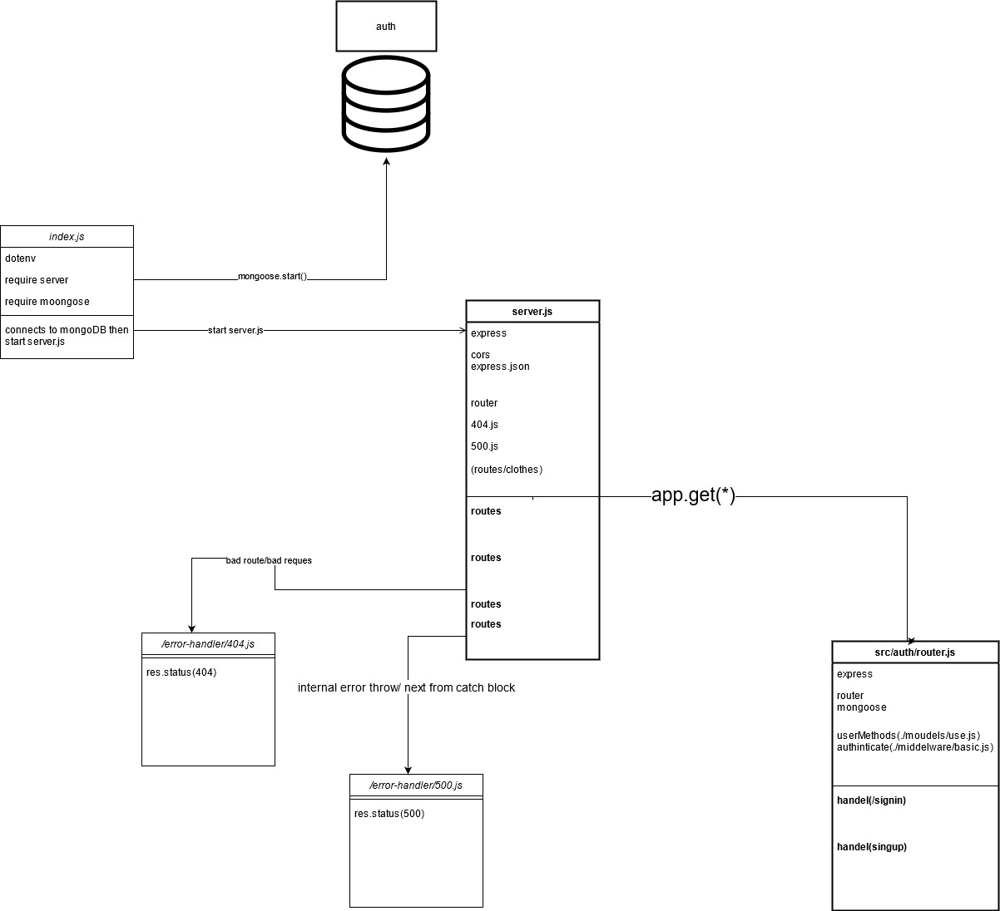
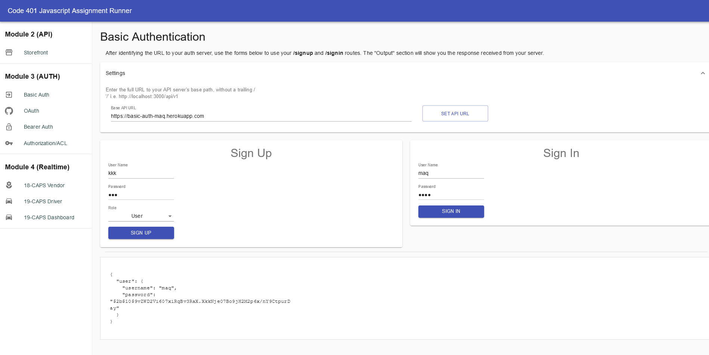

# Lab: Class 06

## Deployment Test

### Author: Mohammad Quthama

- [submission PR](https://github.com/mohammad-qethama/basic-auth/pull/1)
- [tests report](https://github.com/mohammad-qethama/basic-auth/actions)
- [master-deployment](https://basic-auth-maq.herokuapp.com/)

### Setup

#### `.env` requirements

- `PORT` - 3000
- `MONGOOSE_URI` - `mongodb+srv://<username>:<password>@cluster0.pyufn.mongodb.net/auth`

#### Dependencies

- mongoose.
- cors.
- express.
- dotenv
- bcrypt

- base-64

#### Devdependencies

- eslint
- jest
- @codefellows/supergoose

#### Running the app

- `npm start`

- Endpoint: `/signin`
  - Returns status(201)
  - returns json file with user data in it
  - Post methode

```JavaScript

 async function handelSignIn(req,res,next){
 
    try{
        await authenticate(req,res,next);
        console.log('i am in sign in ')
        res.status(200).json({user:{username:req.username,password:req.password}});
    }catch(error){
        res.status(401).json({ error: error.message });
      }
  
     
}

```

- Endpoint: `/signup`
  - Returns status(201)
  - returns json file with the content of the DB table `clothes`
  - Post method

```JavaScript

 async function handelSignUp(req,res){

   try {
    let user = await userMethods.preSaving(req,res);
    const record = await user.save();
    res.status(201).json(record);
   } catch (error) { 
     res.status(403).json({ error: error.message });
    
   }
 }
```

#### Tests

- Unit Tests: `npm run test`
  - test for routing `basic-auth.test.js`
  - test for middelware `basic.js`

#### UML



#### Visualization


